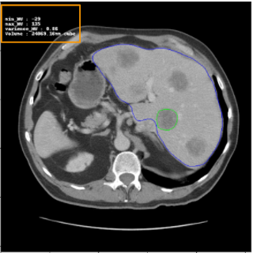
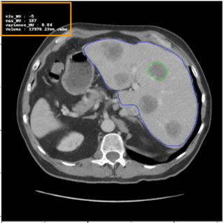
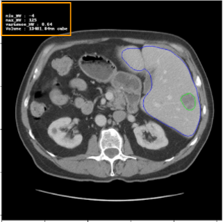
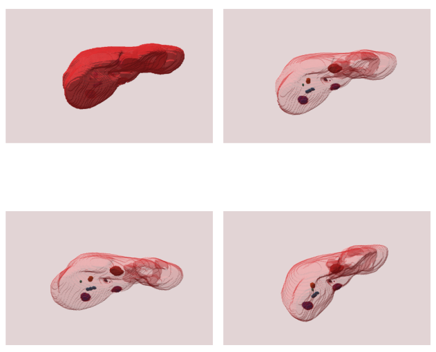
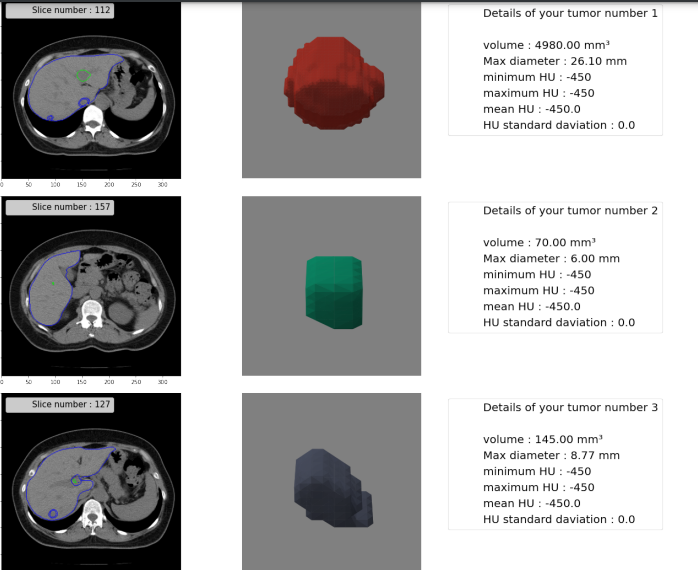

# Liver-Tumor-segmentation
Segmentation of liver tumours on publicly available LITS dataset using different image processing techniques and HDense network.
### Dataset:  
The LITS dataset contains CT scans of patients and annotations for tumor and liver segmentation masks. Whole dataset includes 130 scans.  
Link to dataset used: https://academictorrents.com/details/27772adef6f563a1ecc0ae19a528b956e6c803ce  
  
## Prediction model
*Main model predicts tumor and  liver mask by taking in sequence of frames of scans. First of all model make prediction on full scan sequence by sequency by moving window of those sequnce in 50% overlap and finalliny all predictions are concatinated.*
## Pre-processing
*For image preprocessing, dynamic windowing was applied on liver scans after assessing results from previous trained models (shown in analytical report).*
## Post processing
*In post processing any spaces in liver mask are filled using computer vision techniques and tumor outside the liver are discarded*

## Results presentation
*Finally using liver mask and tumor mask countours are made on actual scans and discription of those scans are saved in dicom format*
### Results:
Improved Dice Score and achieved: 71%  
  
The contoured Liver and Tumor can be seen as:  
 
 
 
 
Results were presented as shown below in 3D for each patient:  
   
  

A report for each patient is compiled in pdf format.
